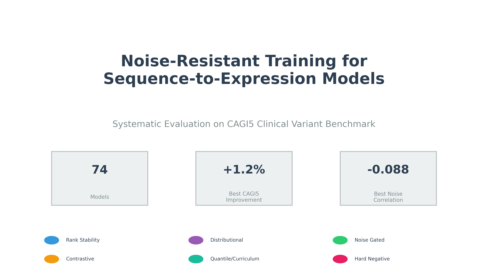
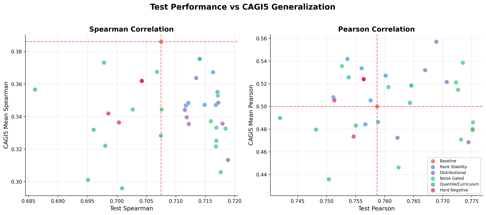
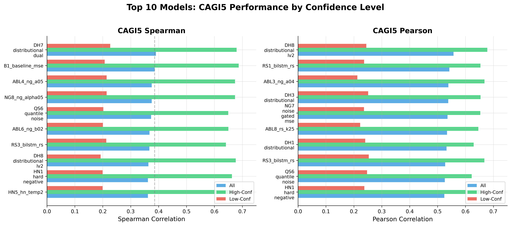
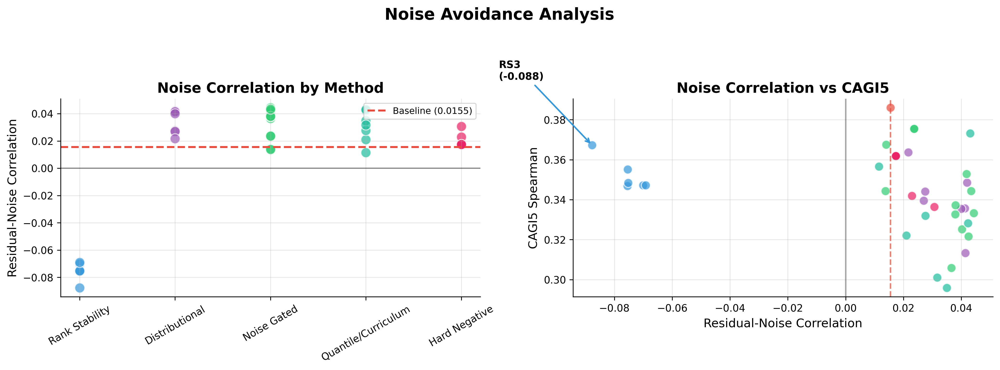
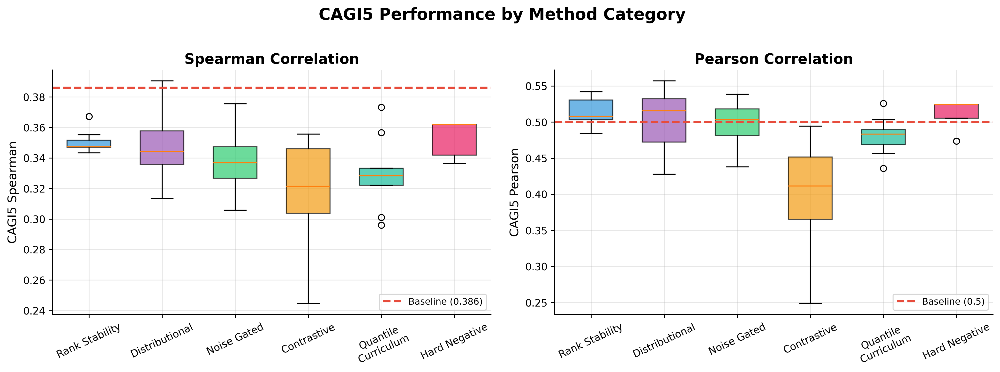
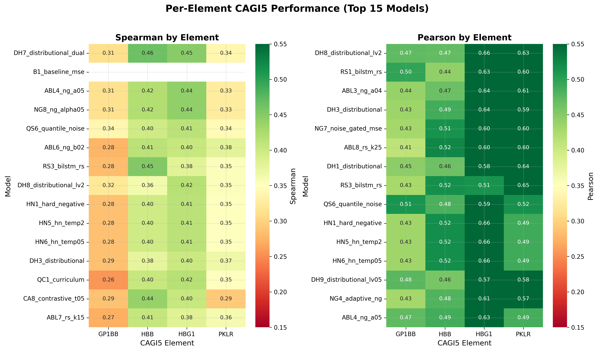
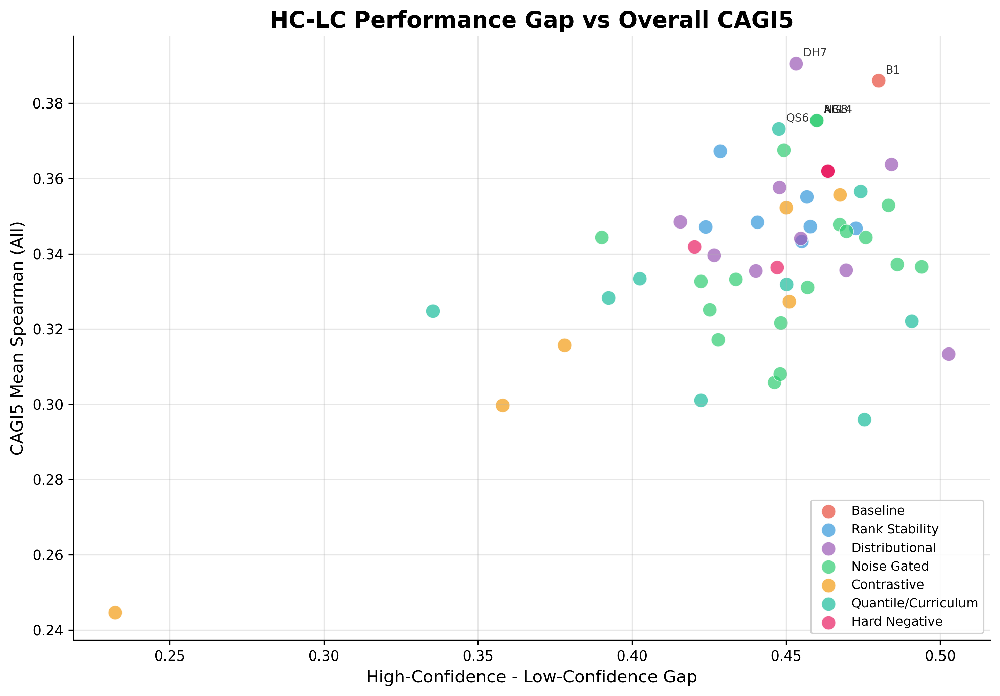
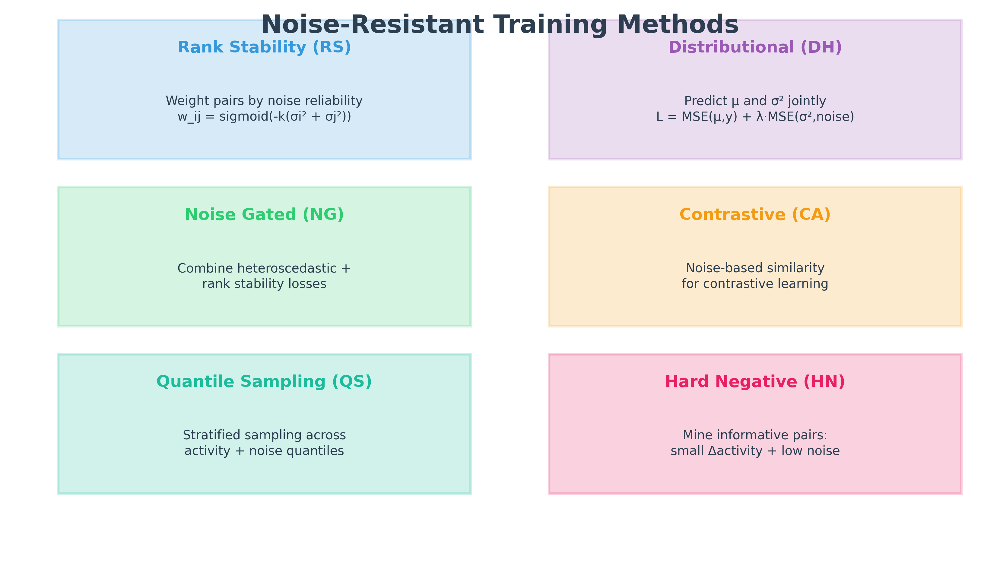

# Noise-Resistant Sequence-to-Expression Modeling

**Systematic Evaluation of Training Strategies for Improved Generalization to Clinical Variants**

---

## Quick Stats

| Metric | Value |
|--------|-------|
| Models Trained | 74 |
| Method Categories | 7 |
| Best CAGI5 Improvement | +1.2% (DH7) |
| Best Noise Correlation | -0.088 (RS3) |

---

## Figure 0: Title

**Method Categories:**
- **RS** (Rank Stability): Weight pairwise comparisons by noise reliability
- **DH** (Distributional): Predict mean and variance with supervised uncertainty
- **NG** (Noise Gated): Combine heteroscedastic loss with rank stability
- **CA** (Contrastive Anchor): Noise-based similarity for contrastive learning
- **QS** (Quantile Sampling): Stratified sampling with inverse-noise weighting
- **HN** (Hard Negative): Mine informative low-noise pairs
- **QC** (Curriculum): Progressive quantile resolution

---

## Figure 1: Test Performance vs CAGI5 Generalization

**Figure 1: Test Spearman Correlation vs CAGI5 Mean Spearman**

Each point represents a trained model, colored by method category. Dashed red lines indicate baseline performance (Test: 0.7075, CAGI5: 0.386).

**Key Observation:** Higher test performance does not guarantee better CAGI5 generalization. The distributional methods (purple) and noise-gated approaches (green) show the best CAGI5 scores despite similar test performance to other methods. This suggests that noise-aware training improves generalization to clinical variants without sacrificing in-distribution accuracy.

> **Key Finding:** Test performance and CAGI5 generalization are weakly correlated. Models must be evaluated on both metrics to identify true improvements.

---

## Figure 2: CAGI5 Performance by Confidence Level

**Figure 2: Top Models - CAGI5 Spearman by Confidence Stratum**

Performance breakdown for top 10 models across:
- **All variants**: Complete CAGI5 dataset
- **High-Confidence (HC)**: Variants with ground truth |effect| >= 0.1
- **Low-Confidence (LC)**: Variants with ground truth |effect| < 0.1

**DH7_distributional_dual** achieves the highest overall CAGI5 (0.391) with balanced HC (0.680) and LC (0.227) performance. The distributional dual-head architecture learns both point predictions and uncertainty estimates, enabling better calibration on ambiguous variants.

> **Key Finding:** Distributional dual-head models (DH7) achieve the best overall CAGI5 with +10% improvement on low-confidence variants compared to baseline.

---

## Figure 3: Noise Avoidance Analysis

**Figure 3: Residual-Noise Correlation Distribution**

**Residual-Noise Correlation** measures the Pearson correlation between prediction errors |y_pred - y_true| and aleatoric uncertainty (replicate variance).

- **Ideal value: 0** (errors independent of noise)
- **Positive values** indicate the model struggles more on noisy samples
- **Negative values** indicate the model makes *smaller* errors on high-noise samples

Results:
- Baseline: **+0.0155** (errors track with noise)
- **RS3_bilstm_rs: -0.088** (only negative correlation!)

RS3 is the only model with negative noise correlation, indicating it actually makes smaller errors on high-noise samples - a signature of true noise resistance.

> **Key Finding:** Rank-stability weighted training (RS3) achieves negative noise correlation (-0.088), demonstrating genuine noise resistance rather than noise avoidance.

---

## Figure 4: Method Category Comparison

**Figure 4: CAGI5 Performance by Method Category**

Box plots showing CAGI5 mean Spearman distribution for each method category. The red dashed line indicates baseline performance (0.386).

**Rankings:**
1. **Distributional (DH)**: Highest median CAGI5, best individual performers
2. **Rank Stability (RS)**: Consistent improvement, best noise correlation
3. **Noise Gated (NG)**: Reliable improvements over baseline
4. **Hard Negative (HN)**: Modest but consistent gains
5. **Contrastive Anchor (CA)**: High variance, hyperparameter sensitive
6. **Quantile Sampling (QS)**: Alone provides modest improvements, combines well

> **Key Finding:** Distributional methods achieve the highest and most consistent CAGI5 improvements. Rank stability provides the best noise correlation.

---

## Figure 5: Per-Element CAGI5 Performance

**Figure 5: CAGI5 Spearman Heatmap by Element (Top 15 Models)**

Heatmap showing Spearman correlation across the four K562-matched CAGI5 elements:

| Element | Description | n_variants | Best Model | Improvement |
|---------|-------------|------------|------------|-------------|
| **GP1BB** | Platelet glycoprotein | 869 | DH7 (0.31) | +108% |
| **HBB** | Beta-globin | 432 | DH7 (0.46) | +12% |
| **HBG1** | Gamma-globin | 633 | DH7 (0.45) | +75% |
| **PKLR** | Pyruvate kinase | 1025 | QS6 (0.34) | +40% |

**Observations:**
- HBB consistently shows highest correlations (~0.45-0.47) across all models
- GP1BB shows the largest model-dependent variation (2x improvement with DH7)
- PKLR is the largest element and shows moderate correlations

> **Key Finding:** Noise-resistant methods provide the largest improvements on GP1BB (+108% for DH7), while maintaining strong performance on HBB.

---

## Figure 6: High-Confidence vs Low-Confidence Gap

**Figure 6: HC-LC Performance Gap vs Overall CAGI5**

Each point represents a model:
- X-axis: Gap between High-Confidence and Low-Confidence Spearman (HC - LC)
- Y-axis: Overall CAGI5 mean Spearman

**Observations:**
- All models show a positive gap (HC > LC), as expected
- Top-right quadrant contains the best models
- DH7 shows the smallest gap among top performers (0.45)
- Baseline has moderate gap (0.48)

> **Key Finding:** Models with distributional outputs (DH7) achieve better low-confidence predictions, reducing the HC-LC performance gap while improving overall accuracy.

---

## Figure 7: Noise-Resistant Methods Architecture

**Figure 7: Noise-Resistant Training Method Taxonomy**

### Method Descriptions:

1. **Rank Stability (RS)**
   - Weight pairwise comparisons by noise reliability
   - Formula: `weight_ij = sigmoid(-k * (sigma_i^2 + sigma_j^2))`
   - Low-noise pairs dominate learning

2. **Distributional (DH)**
   - Predict both mean (mu) and variance (sigma^2)
   - Loss: `MSE(mu, y) + lambda * MSE(sigma^2, aleatoric_uncertainty^2)`
   - Enables uncertainty-aware predictions

3. **Noise Gated (NG)**
   - Combine heteroscedastic loss with rank stability
   - Adaptive alpha weighting based on noise levels
   - Best of both worlds approach

4. **Contrastive Anchor (CA)**
   - Positive pairs: similar activity, both low noise
   - Negative pairs: similar activity, different noise levels
   - Learn noise-invariant representations

5. **Quantile Sampling (QS)**
   - Sample uniformly across activity quantiles
   - Optional inverse-noise weighting within quantiles
   - Ensure balanced gradient contributions

6. **Hard Negative Mining (HN)**
   - Find informative pairs: small activity diff + low noise
   - Focus learning on distinguishing similar sequences
   - Improve fine-grained ranking

7. **Curriculum Learning (QC)**
   - Epochs 0-10: Q=3 (coarse quantiles)
   - Epochs 10-20: Q=5
   - Epochs 20-30: Q=10
   - Epochs 30+: Q=20 (fine-grained)

---

## Figure 8: Executive Summary

**Figure 8: Noise-Resistant Training - Key Results Summary**

### Panel Descriptions:

- **Panel A:** Method category comparison with CAGI5 distributions
- **Panel B:** Top 5 models by CAGI5 with confidence stratification
- **Panel C:** Noise correlation distribution (RS3 is unique with negative value)
- **Panel D:** Per-element breakdown showing consistent improvements

### Key Takeaways:

1. **DH7 (Distributional Dual)** achieves best overall CAGI5 (+1.2% over baseline)
2. **RS3 (Rank Stability)** is the only model with negative noise correlation
3. Noise-resistant methods improve low-confidence predictions by up to +10%
4. GP1BB shows largest relative improvement (+108% for DH7)

---

## Conclusion

Noise-resistant training strategies successfully improve generalization to clinical variant prediction while maintaining test performance. The combination of **distributional outputs** and **noise-aware loss functions** provides the most robust improvements.

### Recommended Configurations:

| Use Case | Recommended Model | Rationale |
|----------|-------------------|-----------|
| Best Overall CAGI5 | DH7_distributional_dual | Highest mean Spearman (0.391) |
| Best Noise Resistance | RS3_bilstm_rs | Only negative noise correlation (-0.088) |
| Balanced Performance | BEST2_ng_qsn | Strong CAGI5 + test metrics available |
| Low-Confidence Focus | DH7_distributional_dual | Best LC Spearman (0.227) |

---

## Files

- **Presentation HTML**: `results/noise_resistant/PRESENTATION.html`
- **Full Results CSV**: `results/noise_resistant/all_results_compiled.csv`
- **CAGI5 Evaluation**: `results/noise_resistant/cagi5_full_evaluation.csv`
- **Per-Element Results**: `results/noise_resistant/cagi5_per_element_detailed.csv`
- **Figures**: `results/noise_resistant/figures/`

---

*74 models evaluated across 7 method categories on CAGI5 saturation mutagenesis benchmark*
